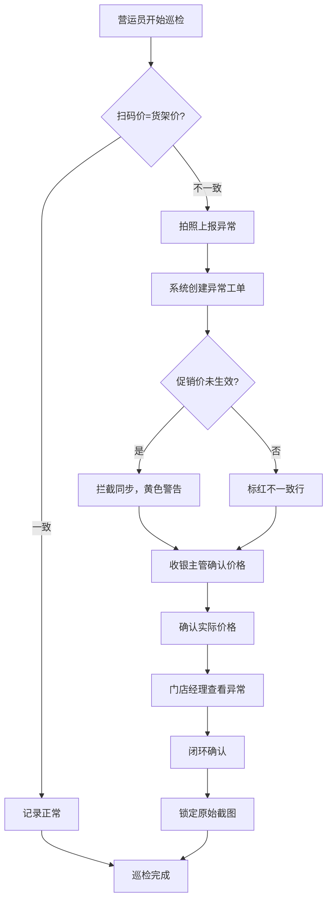

## 1. 产品概述

大型商超电子价签纠错工作台——面向营运员、收银主管和门店经理的三角色协同纠错平台，用于巡检价签一致性、闭环价格异常、防止促销价提前泄露。解决人工巡检效率低、价格异常追溯难、促销价管控缺失等核心痛点。

## 2. 核心功能

### 2.1 用户角色

| 角色 | 注册方式 | 核心权限 |
|------|----------|----------|
| 营运员 | 系统分配 | 巡检价签、上报异常、拍照截图 |
| 收银主管 | 系统分配 | 确认商品价格、审核异常、标记处理结果 |
| 门店经理 | 系统分配 | 查看异常闭环、审批促销价同步、统计报表 |

### 2.2 功能模块

1. **工作台首页**：角色切换、待办统计、快捷入口、异常趋势图
2. **商品列表页**：商品搜索筛选、价签状态标识、促销价管控提示
3. **价签状态页**：扫码价与货架价对比、不一致标红告警、同步状态追踪
4. **巡检记录页**：巡检任务列表、拍照上报、巡检历史回溯
5. **异常闭环页**：异常工单流转、收银主管确认、门店经理闭环确认、截图锁定
6. **异常统计页**：异常类型分布、闭环率趋势、分类排名

### 2.3 页面详情

| 页面名称 | 模块名称 | 功能描述 |
|----------|----------|----------|
| 工作台首页 | 角色切换器 | 顶部角色选择器，切换营运员/收银主管/门店经理视角 |
| 工作台首页 | 待办卡片 | 各角色待处理事项数量统计卡片 |
| 工作台首页 | 异常趋势图 | 近7天异常数量折线图 |
| 商品列表页 | 商品搜索 | 按名称/编码/分类搜索筛选商品 |
| 商品列表页 | 价签状态列 | 每个商品显示价签状态（正常/异常/待同步/促销待生效） |
| 商品列表页 | 促销价管控 | 促销价未生效前禁止同步，显示黄色警告标签 |
| 价签状态页 | 价格对比表 | 扫码价与货架价并列对比，不一致行标红 |
| 价签状态页 | 同步状态 | 价签同步进度、上次同步时间 |
| 巡检记录页 | 巡检任务 | 营运员待巡检/已巡检任务列表 |
| 巡检记录页 | 拍照上报 | 巡检时拍摄货架价签照片并上报 |
| 巡检记录页 | 异常上报 | 发现不一致时一键上报异常 |
| 异常闭环页 | 工单列表 | 异常工单按状态分类（待确认/已确认/已闭环） |
| 异常闭环页 | 确认价格 | 收银主管确认/修正商品实际价格 |
| 异常闭环页 | 闭环确认 | 门店经理查看异常详情并确认闭环 |
| 异常闭环页 | 截图锁定 | 已闭环异常的原始截图不可修改 |
| 异常统计页 | 类型分布 | 饼图展示价格不一致、促销违规等类型占比 |
| 异常统计页 | 闭环率趋势 | 折线图展示近30天闭环率变化 |
| 异常统计页 | 分类排名 | 按商品分类统计异常数量排名 |

## 3. 核心流程

营运员巡检发现异常 → 上报异常并拍照 → 收银主管确认商品实际价格 → 门店经理查看并闭环确认。促销价生效前系统自动拦截同步请求。已闭环异常锁定原始截图不可修改。

## 4. 用户界面设计

### 4.1 设计风格

- 主色调：深蓝灰（#1e293b）搭配警示橙（#f97316）和告警红（#ef4444）
- 辅助色：正常绿（#22c55e）、促销黄（#eab308）、背景浅灰（#f8fafc）
- 按钮风格：圆角（8px）、微阴影、状态色填充
- 字体：中文使用系统字体栈，数字/英文使用等宽字体突出价格
- 布局：左侧导航栏 + 右侧内容区，卡片式模块组织
- 图标：lucide-react 线性图标风格
- 视觉重点：不一致价格行标红、促销管控黄色遮罩、闭环锁定灰色锁定图标

### 4.2 页面设计概述

| 页面名称 | 模块名称 | UI要素 |
|----------|----------|--------|
| 工作台首页 | 角色切换器 | 顶部Tab式切换，当前角色高亮 |
| 工作台首页 | 待办卡片 | 白色卡片+彩色左边框+数字 |
| 工作台首页 | 异常趋势图 | 简洁折线图，橙色调 |
| 商品列表页 | 商品表格 | 表格布局，状态列使用彩色Badge |
| 商品列表页 | 促销警告 | 黄色背景提示条 |
| 价签状态页 | 价格对比 | 双列对比，不一致行红色背景 |
| 巡检记录页 | 任务卡片 | 列表卡片，左侧状态色条 |
| 巡检记录页 | 拍照按钮 | 圆形相机图标按钮 |
| 异常闭环页 | 工单流程 | 步骤条展示流转状态 |
| 异常闭环页 | 截图锁定 | 灰色遮罩+锁定图标覆盖 |
| 异常统计页 | 图表区 | 饼图+折线图+柱状图组合 |

### 4.3 响应式设计

- 桌面端优先，最小宽度1280px
- 左侧导航可折叠，内容区自适应
- 表格支持水平滚动
- 图表容器等比缩放

### 4.4 动效设计

- 页面切换：淡入淡出
- 卡片悬停：微上移+阴影加深
- 标红行：轻微脉冲动画吸引注意
- 闭环锁定：锁图标落下动画
- 促销警告：轻微闪烁提示
