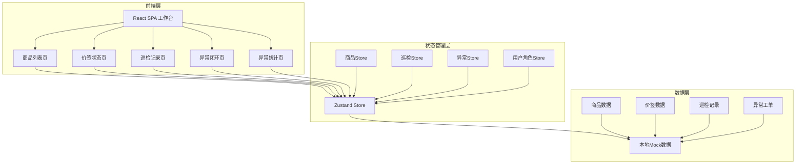
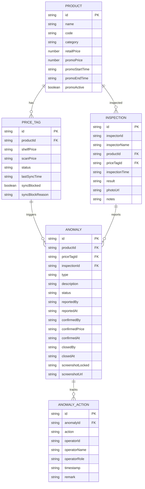

## 1. 架构设计

## 2. 技术说明

- 前端：React@18 + TypeScript + Vite + Tailwind CSS@3
- 状态管理：Zustand
- 路由：react-router-dom@6
- 图表：recharts
- 图标：lucide-react
- 后端：无（纯前端，本地数据支撑）
- 数据：Mock数据存储在前端，通过Zustand管理

## 3. 路由定义

| 路由 | 用途 |
|------|------|
| / | 工作台首页，角色切换+待办统计+趋势图 |
| /products | 商品列表页，搜索筛选+价签状态标识 |
| /price-tags | 价签状态页，扫码价与货架价对比 |
| /inspections | 巡检记录页，营运员巡检任务管理 |
| /anomalies | 异常闭环页，工单流转与闭环管理 |
| /statistics | 异常统计页，图表展示异常数据 |

## 4. 数据模型

### 4.1 数据模型定义

### 4.2 数据定义

- 商品数据：30+条模拟商品，涵盖生鲜、日化、食品、饮料等分类，部分含促销价
- 价签数据：每个商品对应一条价签记录，约30%存在不一致
- 巡检记录：20+条历史巡检记录，含正常和异常
- 异常工单：10+条异常工单，覆盖待确认/已确认/已闭环各状态
